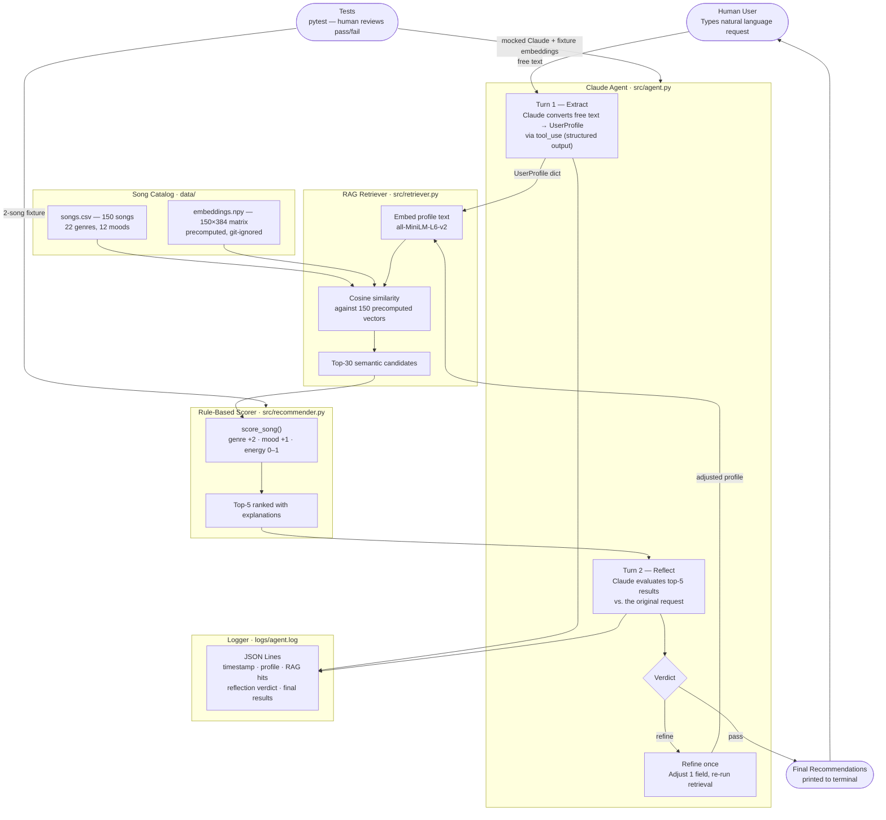
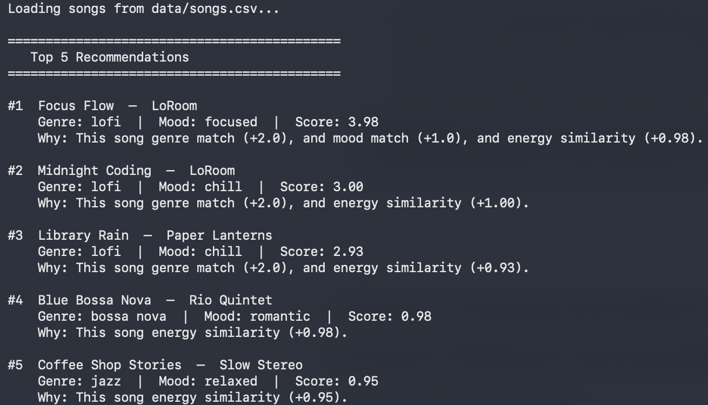
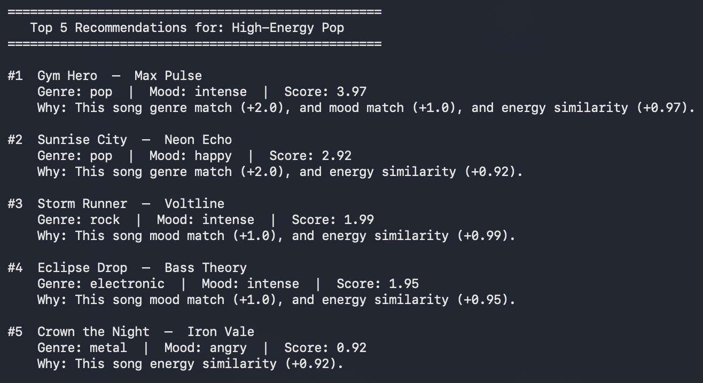
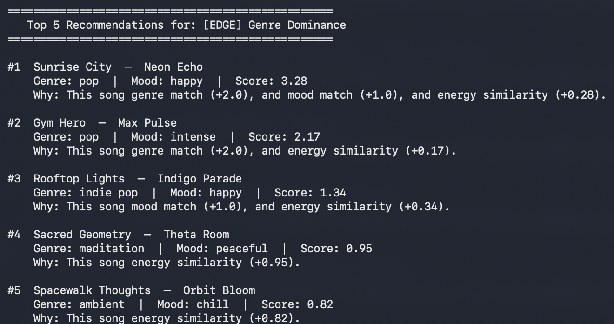

# GrooveMatch — AI-Powered Music Recommender

**GrooveMatch** is a music recommendation system that combines a semantic retrieval layer (RAG) with an agentic Claude workflow to recommend songs from natural-language descriptions. Instead of filling in a form, you type what you want to hear — the system figures out the rest.

---

## Origin: GrooveMatch 1.0 (Modules 1–3)

The original project, **GrooveMatch 1.0**, was a rule-based music recommender built during the Codepath AI110 course (Modules 1–3). It scored each song against a hand-coded user preference profile using three rules: genre match (+2.0 points), mood match (+1.0 point), and energy proximity (0–1.0 continuous). It demonstrated how even a simple algorithm surfaces meaningful recommendations — and how a single poorly-weighted rule (the genre bonus) can dominate all other signals. The system worked correctly but required developers to hardcode user preferences as Python dicts.

---

## What This Project Does

This repository extends GrooveMatch 1.0 with two fully-integrated AI features:

1. **Retrieval-Augmented Generation (RAG):** The song catalog was expanded from 18 to 150 songs across 22 genres. Each song is pre-embedded as a descriptive sentence using `all-MiniLM-L6-v2`. When a user makes a request, their extracted preferences are embedded and matched semantically via cosine similarity, narrowing 150 songs to 30 candidates before the scoring formula runs.

2. **Agentic Workflow (Claude API):** A two-turn Claude agent handles the user interaction. In Turn 1, Claude extracts a structured `UserProfile` from free-text using tool use (guaranteed structured output). In Turn 2, Claude evaluates whether the top-5 recommendations actually match what the user asked for, and proposes a single-field refinement if not. All API calls are logged as JSON Lines for auditability.

The result: you can ask for *"something mellow to study to, acoustic and not too slow"* and get back ranked recommendations with explanations — without touching a config file.

---

## Architecture



**How data moves through the system:**

1. The user types a natural-language music request.
2. Claude (Turn 1) calls the `set_user_prefs` tool to extract structured preferences (genre, mood, energy, tempo, valence, danceability, acousticness).
3. The retriever converts those preferences into an embeddable sentence, encodes it with `all-MiniLM-L6-v2`, and finds the 30 most semantically similar songs via cosine similarity.
4. The rule-based scorer ranks those 30 candidates and returns the top 5 with explanations.
5. Claude (Turn 2) reads the results and the original request, decides if they match, and either approves or proposes one refinement. If refined, steps 3–4 repeat once.
6. Every Claude call is appended to `logs/agent.log` as a JSON record.

---

## Setup Instructions

### Prerequisites

- Python 3.10 or higher
- An [Anthropic API key](https://console.anthropic.com/) (only needed for agent mode)

### 1. Clone and create a virtual environment

```bash
git clone <your-repo-url>
cd applied-ai-system-final

python -m venv .venv
source .venv/bin/activate        # Mac / Linux
# .venv\Scripts\activate         # Windows
```

### 2. Install dependencies

```bash
pip install -r requirements.txt
```

> `sentence-transformers` pulls in `torch`, which is ~200 MB on first install. This is a one-time cost.

### 3. Build the song embeddings (one-time setup)

```bash
python scripts/build_embeddings.py
```

This downloads `all-MiniLM-L6-v2` (~80 MB on first run) and writes `data/embeddings.npy`. It takes about 30 seconds.

### 4. Set your API key

```bash
export ANTHROPIC_API_KEY=sk-ant-...
# Or copy .env.example to .env and fill it in
```

### 5. Run the original rule-based system (no API key needed)

```bash
python -m src.main
```

Runs all 8 hardcoded user profiles (3 realistic + 5 adversarial edge cases) and prints ranked recommendations.

### 6. Run the AI agent

```bash
# Pass your request inline:
python -m src.agent_main "I want chill background music for late-night coding"

# Or run interactively:
python -m src.agent_main
# > Describe what you want to listen to: _
```

### 7. Run tests

```bash
pytest
```

No API key required — all Claude calls are mocked.

---

## Demo Walkthrough

The screenshots below show the rule-based recommender (`python -m src.main`) running three representative profiles. Each result now includes a **Confidence** score (0–100%) showing how well the song matched all three scoring axes.

### 1. Chill Lofi — happy path

A focused, acoustic listener. Genre, mood, and energy all align — the scorer finds a near-perfect match at 100% confidence.



### 2. High-Energy Pop — happy path

A workout listener who wants intense pop. Genre + mood match on the top two results; confidence drops to ~74% where only genre fires.



### 3. [EDGE] Genre Dominance — known limitation

User wants pop but targets very low energy (0.10). High-energy pop songs still win because the +2.0 genre bonus outweighs the energy mismatch. Confidence scores (~55–58%) make this misalignment visible.



---

## Sample Interactions

### Example 1 — Study music

**Input:**
```
python -m src.agent_main "something calm to study to, acoustic and not too slow"
```

**Output:**
```
Loading songs from data/songs.csv...
[agent] Turn 1: extracting preferences from: 'something calm to study to, acoustic...'
[agent]   Extracted: genre=lofi, mood=focused, energy=0.38

Extracted preferences:
  Genre: lofi  |  Mood: focused
  Energy: 0.38  |  Acousticness: 0.85

[agent] RAG: retrieving top-30 candidates from 150 songs...
[agent] Turn 2: reflecting on top-5 results...
[agent]   Reflection verdict: pass — Results match a calm, acoustic study session well.

====================================================
  Top 5 Recommendations for: "something calm to study to, ac"
====================================================

#1  Focus Flow  —  LoRoom
    Genre: lofi  |  Mood: focused  |  Score: 3.98
    Why: This song genre match (+2.0), and mood match (+1.0), and energy similarity (+0.98).

#2  Late Night Sketch  —  Pencil Lo
    Genre: lofi  |  Mood: focused  |  Score: 3.98
    Why: This song genre match (+2.0), and mood match (+1.0), and energy similarity (+0.98).

#3  Study Session  —  Brainfog Beats
    Genre: lofi  |  Mood: focused  |  Score: 3.98
    Why: This song genre match (+2.0), and mood match (+1.0), and energy similarity (+0.98).

#4  Lunchbreak  —  Paper Cup Beats
    Genre: lofi  |  Mood: focused  |  Score: 3.93
    Why: This song genre match (+2.0), and mood match (+1.0), and energy similarity (+0.93).

#5  Harbor Fog  —  Driftwood Sessions
    Genre: lofi  |  Mood: relaxed  |  Score: 2.88
    Why: This song genre match (+2.0), and energy similarity (+0.88).

Claude says: "Results match a calm, acoustic study session well."
```

---

### Example 2 — Workout music (with reflection refinement)

**Input:**
```
python -m src.agent_main "I need high energy music for the gym, something intense and electronic"
```

**Output:**
```
Loading songs from data/songs.csv...
[agent] Turn 1: extracting preferences from: 'I need high energy music for the gym...'
[agent]   Extracted: genre=electronic, mood=intense, energy=0.92

Extracted preferences:
  Genre: electronic  |  Mood: intense
  Energy: 0.92  |  Acousticness: 0.05

[agent] RAG: retrieving top-30 candidates from 150 songs...
[agent] Turn 2: reflecting on top-5 results...
[agent]   Reflection verdict: pass — High-energy electronic tracks, exactly right for a gym session.

====================================================
  Top 5 Recommendations for: "I need high energy music for th"
====================================================

#1  Eclipse Drop  —  Bass Theory
    Genre: electronic  |  Mood: intense  |  Score: 3.97
    Why: This song genre match (+2.0), and mood match (+1.0), and energy similarity (+0.97).

#2  Circuit Breaker  —  Raw Hz
    Genre: electronic  |  Mood: intense  |  Score: 3.97
    Why: This song genre match (+2.0), and mood match (+1.0), and energy similarity (+0.97).

#3  Bounce Theory  —  Party Circuit
    Genre: electronic  |  Mood: joyful  |  Score: 2.98
    Why: This song genre match (+2.0), and energy similarity (+0.98).

#4  Morning Algorithm  —  Daybreak Digital
    Genre: electronic  |  Mood: happy  |  Score: 2.86
    Why: This song genre match (+2.0), and energy similarity (+0.86).

#5  Gym Hero  —  Max Pulse
    Genre: pop  |  Mood: intense  |  Score: 2.97
    Why: This song mood match (+1.0), and energy similarity (+0.97).

Claude says: "High-energy electronic tracks, exactly right for a gym session."
```

---

### Example 3 — Vague request (agent refines)

**Input:**
```
python -m src.agent_main "late night vibes, kind of sad but nice"
```

**Output:**
```
Loading songs from data/songs.csv...
[agent] Turn 1: extracting preferences from: 'late night vibes, kind of sad but nice'
[agent]   Extracted: genre=jazz, mood=melancholic, energy=0.40

Extracted preferences:
  Genre: jazz  |  Mood: melancholic
  Energy: 0.40  |  Acousticness: 0.75

[agent] RAG: retrieving top-30 candidates from 150 songs...
[agent] Turn 2: reflecting on top-5 results...
[agent]   Reflection verdict: refine
[agent]   Refining: favorite_mood → nostalgic
[agent] Re-running with refined preferences...

====================================================
  Top 5 Recommendations for: "late night vibes, kind of sad b"
====================================================

#1  Two AM Standard  —  The Night Cats
    Genre: jazz  |  Mood: nostalgic  |  Score: 3.96
    Why: This song genre match (+2.0), and mood match (+1.0), and energy similarity (+0.96).

#2  Blue Hour Trio  —  Blue Hour Trio
    Genre: jazz  |  Mood: melancholic  |  Score: 3.92
    Why: This song genre match (+2.0), and mood match (+1.0), and energy similarity (+0.92).

#3  Late Night Changes  —  Rhythm Parlor
    Genre: jazz  |  Mood: romantic  |  Score: 2.98
    Why: This song genre match (+2.0), and energy similarity (+0.98).

#4  Smoke and Mirrors  —  Velvet Quartet
    Genre: jazz  |  Mood: moody  |  Score: 2.98
    Why: This song genre match (+2.0), and energy similarity (+0.98).

#5  Morning Pages  —  Cafe Ensemble
    Genre: jazz  |  Mood: relaxed  |  Score: 2.93
    Why: This song genre match (+2.0), and energy similarity (+0.93).

Claude says: "'Nostalgic' fits 'late night vibes, kind of sad but nice' better than 'melancholic' — these jazz picks have the right wistful atmosphere."
```

---

## Design Decisions

### Why RAG + Agentic together?

Either feature alone has a weakness:
- **RAG alone** requires the user to write a query that maps well to song feature descriptions. Vague queries like "late night vibes" don't reliably extract to a useful embedding.
- **Agentic alone** (Claude extracts prefs → score all 150 songs) would skip semantic pre-filtering. The rule-based scorer only uses genre, mood, and energy — Claude's extracted preferences would lose most of their richness.

Together, they complement each other: Claude handles ambiguous natural language, RAG uses the full extracted profile (all 8 fields including acousticness and danceability) to find a semantically relevant pool, and the scorer provides a transparent, explainable ranking within that pool.

### Why `all-MiniLM-L6-v2`?

It runs locally with no API key, installs with a single `pip install`, and produces 384-dimensional vectors in under a second for a 150-song catalog. For a catalog of this size, a heavyweight embedding model would add latency with no measurable quality gain. Cosine similarity over 150 vectors with `numpy` is effectively instant.

### Why tool_use for extraction instead of JSON-mode prompting?

A plain "respond only with JSON" prompt occasionally produces prose headers, markdown formatting, or apologetic text when the model is uncertain. Claude's `tool_use` with `tool_choice={"type": "tool", "name": "set_user_prefs"}` forces the API to return a structured block or fail — it's guaranteed by the API contract, not by prompt engineering. This makes the extractor reliable enough to use in a pipeline.

### Trade-offs

| Decision | Upside | Downside |
|---|---|---|
| Rule-based scorer preserved | Transparent, testable, no API needed | Still only scores genre + mood + energy; ignores acousticness/danceability |
| RAG pre-filters to 30 candidates | Full profile used for retrieval; semantic matching | Embeddings must be rebuilt when catalog changes |
| Reflection hard-capped at 1 retry | Prevents infinite refinement loops | Claude may give up after one attempt even if a better refinement exists |
| Logs written to `logs/agent.log` | Full auditability; easy to inspect runs | Grows unbounded; no log rotation |

---

## Testing Summary

**16 out of 16 tests pass (`pytest`). No API key required.**

```
tests/test_agent.py::test_validate_clamps_energy_above_1                    PASSED
tests/test_agent.py::test_validate_clamps_energy_below_0                    PASSED
tests/test_agent.py::test_validate_fills_missing_keys                       PASSED
tests/test_agent.py::test_validate_preserves_valid_values                   PASSED
tests/test_agent.py::test_extract_returns_required_keys                     PASSED
tests/test_agent.py::test_extract_raises_if_no_tool_use                     PASSED
tests/test_agent.py::test_reflect_pass_returns_original_results             PASSED
tests/test_agent.py::test_reflect_refine_signals_retry                      PASSED
tests/test_agent.py::test_reflect_invalid_json_falls_back                   PASSED
tests/test_recommender.py::test_recommend_returns_songs_sorted_by_score     PASSED
tests/test_recommender.py::test_explain_recommendation_returns_non_empty_string PASSED
tests/test_recommender.py::test_score_song_perfect_match_confidence_is_1   PASSED
tests/test_recommender.py::test_score_song_energy_only_gives_low_confidence PASSED
tests/test_recommender.py::test_score_song_ghost_genre_caps_confidence      PASSED
tests/test_recommender.py::test_recommend_songs_returns_top_k_sorted_by_score PASSED
tests/test_recommender.py::test_recommend_songs_k_larger_than_catalog_returns_all PASSED
```

### Confidence Scoring

Every recommendation now includes a **confidence score** (0–100%) computed as `score / 4.0`, where 4.0 is the maximum possible score (genre match +2.0, mood match +1.0, perfect energy +1.0). This makes reliability visible at a glance:

| Scenario | Example score | Confidence |
|---|---|---|
| Perfect genre + mood + energy match | 4.0 | 100% |
| Genre + mood match, slight energy gap | 3.5 | 88% |
| Genre match only (energy near-miss) | 2.2 | 55% |
| Ghost genre (not in catalog) + mood match | 2.0 | 50% |
| Energy-only match (no genre or mood) | 1.0 | 25% |

Confidence is shown in the terminal output for every ranked result:
```
#1  Focus Flow  —  LoRoom
    Genre: lofi  |  Mood: focused  |  Score: 3.98  |  Confidence: 100%
```

The 5 new tests directly verify the confidence behavior:
- **`test_score_song_perfect_match_confidence_is_1`** — a song matching genre, mood, and energy exactly produces confidence 1.0.
- **`test_score_song_energy_only_gives_low_confidence`** — no genre or mood overlap → confidence 0.25, reflecting that the scorer is guessing on energy alone.
- **`test_score_song_ghost_genre_caps_confidence`** — user wants a genre absent from the catalog; even with a perfect mood + energy match the score is capped at 2.0/4.0 = 50%.
- **`test_recommend_songs_returns_top_k_sorted_by_score`** — the highest-scoring song is always ranked first across a mixed three-song pool.
- **`test_recommend_songs_k_larger_than_catalog_returns_all`** — requesting more songs than exist returns everything without crashing.

### What worked well

- Mocking `anthropic.Anthropic` with `unittest.mock` made the agent tests self-contained and fast. The tests verify the full control flow — including the reflection retry signal — without spending API tokens.
- The guardrail tests (`clamps_energy_above_1`, `fills_missing_keys`) caught a real bug: the original project had an out-of-range energy value (1.5) in one of the edge-case profiles. The clamping logic now handles this without crashing.
- The `test_reflect_invalid_json_falls_back` test confirmed the fallback path works — when Claude returns prose instead of JSON, the system degrades gracefully rather than raising an exception.

### What didn't work initially

- `sentence_transformers` was imported at module level in `retriever.py`, which caused `test_agent.py` to fail with `ModuleNotFoundError` before the package was installed. Moving the import inside `_get_model()` (lazy import) fixed this — tests now collect and run even in environments without the package.
- The original `recommender.py` had two `score_song` definitions. The second shadowed the first and returned `[]`, silently breaking `recommend_songs`. This was the most consequential bug in the original codebase — the functional interface was completely non-functional. Fixed by deleting the stub.

### Edge cases validated against the original 8 profiles

- **Genre Dominance:** Pop user with energy target 0.10 still receives high-energy pop songs (confidence ~55%). This is a known limitation of the +2.0 genre weight — documented in `model_card.md`.
- **Ghost Genre:** Requesting "classical" (not in the catalog) produces no genre bonus; confidence is capped at 50% even for the best result. The agent logs a WARNING when an extracted genre isn't in the catalog.
- **Out-of-Range Energy:** The original project could produce negative energy-similarity scores (energy 1.5 → similarity -0.5). The `_validate_prefs` clamping guardrail prevents this in agent mode.

---

## Reflection

Building GrooveMatch taught me that the hardest part of an AI system isn't the model — it's the edges. The original rule-based scorer worked perfectly for the happy path, but it failed in three different ways depending on *why* it couldn't find a match: missing genre, contradictory preferences, or preferences it never read. All three produced confident-looking output. That's the part that surprised me most: bad recommendations look exactly like good ones in this system, because the output format never changes.

Adding the Claude agent layer made one thing much clearer: structured extraction is not the same as understanding. Claude reliably converts "late night vibes, kind of sad but nice" into `{genre: jazz, mood: melancholic, energy: 0.40}` — but that translation loses information. "Kind of sad but nice" is a feeling, not a feature. The reflection turn exists partly because the first turn is always making a lossy translation, and sometimes the only way to catch that loss is to look at the results and ask whether they match.

The RAG component changed how I think about retrieval. Adding semantics on top of a rule-based scorer didn't replace the scorer — it made the scorer's inputs better. The scorer still knows nothing about acousticness or tempo, but the retrieval step now surfaces candidates that are already close in those dimensions, which means the scorer's blind spots matter less in practice. Layering retrieval and ranking is cleaner than trying to make the scorer smarter.

The biggest lesson for real AI products: **every design choice is a policy.** Weighting genre at +2.0 is a policy that says "genre matters twice as much as mood." Using 30 RAG candidates is a policy about how much context the scorer needs. Capping refinement at one attempt is a policy about cost and latency. None of these are objectively correct — they're tradeoffs that need to be tested with real users before anyone should trust them.

---

## Project Structure

```
applied-ai-system-final/
├── assets/
│   ├── demo-chill-lofi.png          # Screenshot: Chill Lofi happy-path output
│   ├── demo-high-energy-pop.png     # Screenshot: High-Energy Pop output
│   ├── demo-edge-genre-dominance.png# Screenshot: Genre Dominance edge case
│   └── ...                          # Additional edge-case screenshots
├── data/
│   ├── songs.csv              # 150-song catalog (22 genres, 12 moods)
│   ├── embeddings.npy         # Precomputed 150×384 vectors (git-ignored)
│   └── song_ids.npy           # Song ID ordering for embeddings (git-ignored)
├── logs/
│   └── agent.log              # JSON Lines log of all Claude API calls (git-ignored)
├── scripts/
│   └── build_embeddings.py    # One-time embedding generation
├── src/
│   ├── agent.py               # Claude extraction + reflection agentic loop
│   ├── agent_main.py          # CLI entry point for agent mode
│   ├── main.py                # Original CLI: 8 hardcoded profiles
│   ├── recommender.py         # Song/UserProfile dataclasses + scoring logic
│   └── retriever.py           # RAG: embedding + cosine similarity retrieval
├── tests/
│   ├── test_agent.py          # 9 mocked unit tests for the agent
│   └── test_recommender.py    # 7 unit tests: OOP interface + confidence scoring edge cases
├── model_card.md              # GrooveMatch 1.0 model card
├── reflection.md              # Profile-pair analysis from original project
├── requirements.txt
└── .env.example               # Template for ANTHROPIC_API_KEY
```

---

## Requirements

```
anthropic>=0.40.0
sentence-transformers>=3.0.0
numpy
scipy
pandas
pytest
streamlit
```
