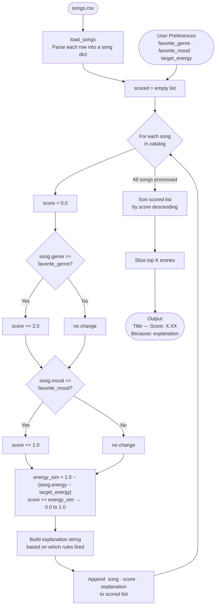

# 🎵 Music Recommender Simulation

## Project Summary

In this project you will build and explain a small music recommender system.

Your goal is to:

- Represent songs and a user "taste profile" as data
- Design a scoring rule that turns that data into recommendations
- Evaluate what your system gets right and wrong
- Reflect on how this mirrors real world AI recommenders

Replace this paragraph with your own summary of what your version does.

---

## How The System Works

### What data each Song and UserProfile store

Each `Song` stores both categorical and numeric features:

- **Categorical:** `id`, `title`, `artist`, `genre`, `mood`
- **Numeric:** `energy` (0–1), `tempo_bpm`, `valence` (0–1), `danceability` (0–1), `acousticness` (0–1)

Each `UserProfile` stores the user's taste targets:

- **Categorical preferences:** `favorite_genre`, `favorite_mood`
- **Numeric targets:** `target_energy`, `target_tempo_bpm`, `target_valence`, `target_danceability`, `target_acousticness`
- **Convenience flag:** `likes_acoustic`

---

### Algorithm Recipe

For every song in the catalog, the system computes a score using three rules applied in sequence:

| Rule | Points awarded |
|---|---|
| `song.genre == favorite_genre` | **+2.0** (fixed bonus) |
| `song.mood == favorite_mood` | **+1.0** (fixed bonus) |
| Energy similarity | **+0.0 to +1.0** — calculated as `1.0 - abs(song.energy - target_energy)` |
| **Maximum possible score** | **4.0** |

The energy rule is continuous, not binary. A perfect energy match gives +1.0. A difference of 0.5 gives +0.5. A difference of 1.0 gives 0.0. This means two songs that both match genre and mood are separated entirely by how close their energy is to the user's target.

After every song is scored, the list is sorted by score descending and the top `k` results are returned (default `k = 5`).

---

### Potential Biases

- **Genre over-prioritization.** A +2.0 genre bonus is twice the mood bonus. A lofi song in the wrong mood will almost always outrank a perfectly mood-matched song from another genre. A jazz track tagged "focused" will consistently lose to a lofi track tagged "chill" for a user who wants focused lofi — which is the opposite of what the user actually needs in that moment.

- **Small catalog amplifies genre imbalance.** The catalog has only 3 lofi songs, 2 pop songs, and 1 song each for most other genres. A user whose favorite genre is underrepresented gets 3 candidates at most, regardless of how many songs would suit their mood or energy.

- **Energy is the only numeric signal.** Tempo, valence, danceability, and acousticness are loaded but never scored. Two songs can have identical scores while sounding very different — for example, a slow acoustic ballad and a fast electronic track could tie if they share genre, mood, and energy level.

- **No diversity.** The algorithm always returns the closest matches. It will never surface a surprising but enjoyable song outside the user's stated preferences, which is a pattern real recommenders work hard to counteract.

### Data Flow



 ### Terminal Output Sample
 

 ### High-Energy Pop
 

 ### Chill Lofi
 

 ### Deep Intense Rock
 

 ### Contradictory Energy + Mood (Edge)
 

 ### Ghost Genre (Edge)
 

 ### Silent Preferences (Edge)
 

 ### Out-of-Range Energy (Edge)
 

 ### Genre Dominance (Edge)
 
 
---

## Getting Started

### Setup

1. Create a virtual environment (optional but recommended):

   ```bash
   python -m venv .venv
   source .venv/bin/activate      # Mac or Linux
   .venv\Scripts\activate         # Windows

2. Install dependencies

```bash
pip install -r requirements.txt
```

3. Run the app:

```bash
python -m src.main
```

### Running Tests

Run the starter tests with:

```bash
pytest
```

You can add more tests in `tests/test_recommender.py`.

---

## Experiments You Tried

Use this section to document the experiments you ran. For example:

- What happened when you changed the weight on genre from 2.0 to 0.5
- What happened when you added tempo or valence to the score
- How did your system behave for different types of users

---

## Limitations and Risks

Summarize some limitations of your recommender.

Examples:

- It only works on a tiny catalog
- It does not understand lyrics or language
- It might over favor one genre or mood

You will go deeper on this in your model card.

---

## Reflection

Read and complete `model_card.md`:

[**Model Card**](model_card.md)

Write 1 to 2 paragraphs here about what you learned:

- about how recommenders turn data into predictions
- about where bias or unfairness could show up in systems like this


---

## 7. `model_card_template.md`

Combines reflection and model card framing from the Module 3 guidance. :contentReference[oaicite:2]{index=2}  

```markdown
# 🎧 Model Card - Music Recommender Simulation

## 1. Model Name

Give your recommender a name, for example:

> VibeFinder 1.0

---

## 2. Intended Use

- What is this system trying to do
- Who is it for

Example:

> This model suggests 3 to 5 songs from a small catalog based on a user's preferred genre, mood, and energy level. It is for classroom exploration only, not for real users.

---

## 3. How It Works (Short Explanation)

Describe your scoring logic in plain language.

- What features of each song does it consider
- What information about the user does it use
- How does it turn those into a number

Try to avoid code in this section, treat it like an explanation to a non programmer.

---

## 4. Data

Describe your dataset.

- How many songs are in `data/songs.csv`
- Did you add or remove any songs
- What kinds of genres or moods are represented
- Whose taste does this data mostly reflect

---

## 5. Strengths

Where does your recommender work well

You can think about:
- Situations where the top results "felt right"
- Particular user profiles it served well
- Simplicity or transparency benefits

---

## 6. Limitations and Bias

Where does your recommender struggle

Some prompts:
- Does it ignore some genres or moods
- Does it treat all users as if they have the same taste shape
- Is it biased toward high energy or one genre by default
- How could this be unfair if used in a real product

---

## 7. Evaluation

How did you check your system

Examples:
- You tried multiple user profiles and wrote down whether the results matched your expectations
- You compared your simulation to what a real app like Spotify or YouTube tends to recommend
- You wrote tests for your scoring logic

You do not need a numeric metric, but if you used one, explain what it measures.

---

## 8. Future Work

If you had more time, how would you improve this recommender

Examples:

- Add support for multiple users and "group vibe" recommendations
- Balance diversity of songs instead of always picking the closest match
- Use more features, like tempo ranges or lyric themes

---

## 9. Personal Reflection

A few sentences about what you learned:

- What surprised you about how your system behaved
- How did building this change how you think about real music recommenders
- Where do you think human judgment still matters, even if the model seems "smart"

